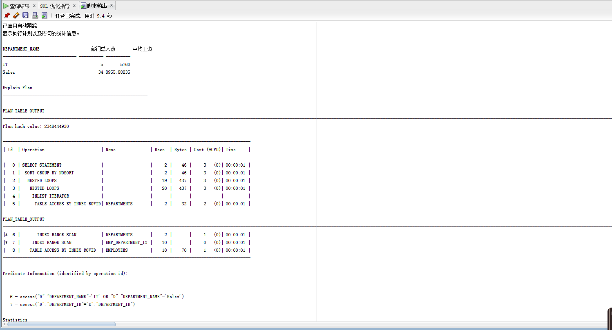
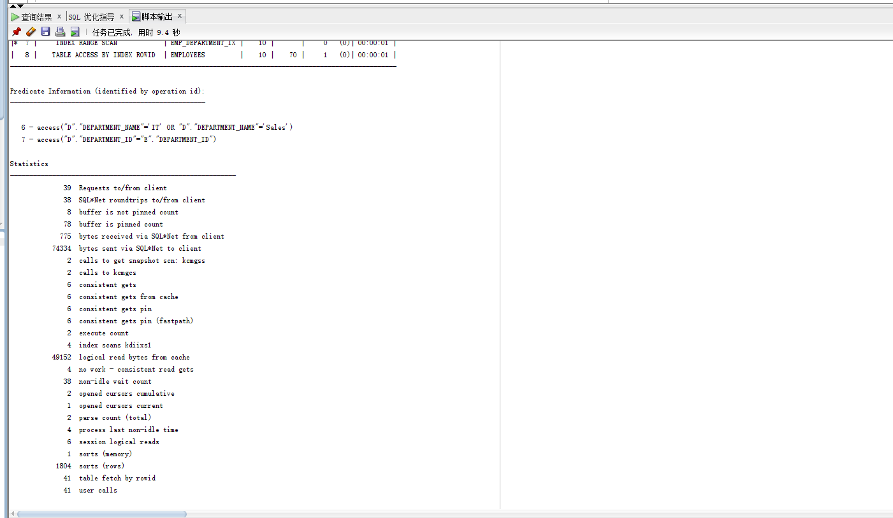
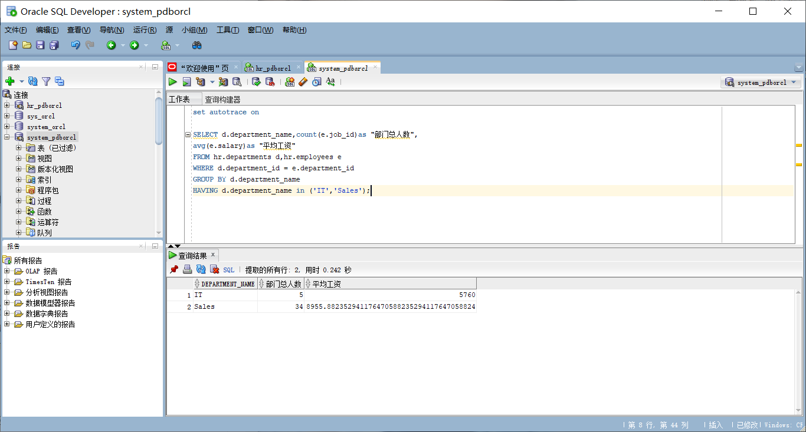
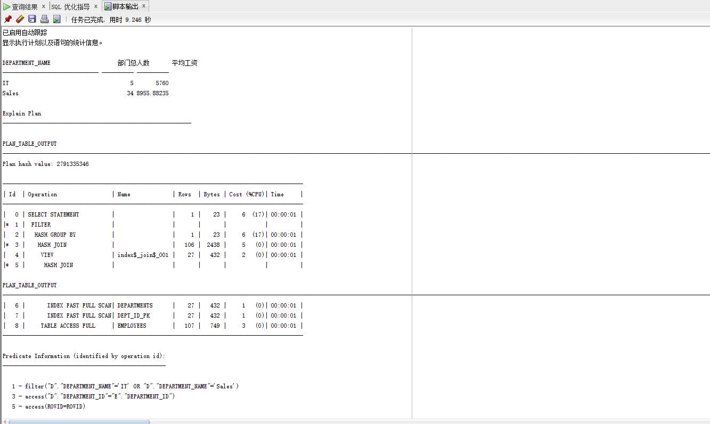
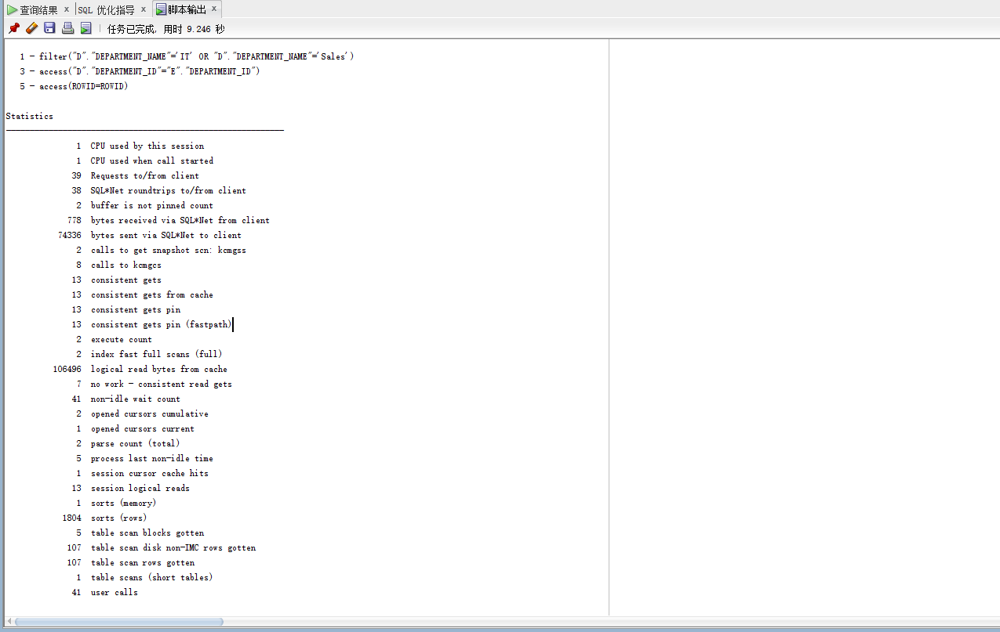
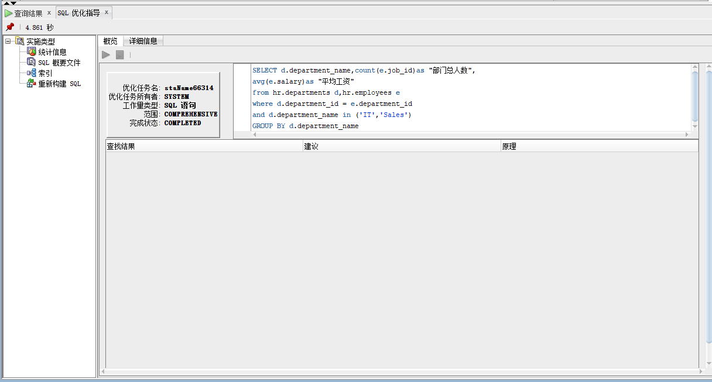
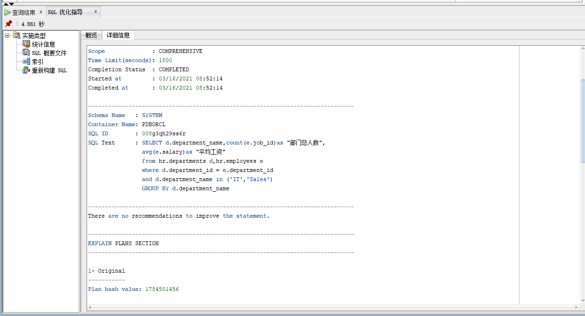
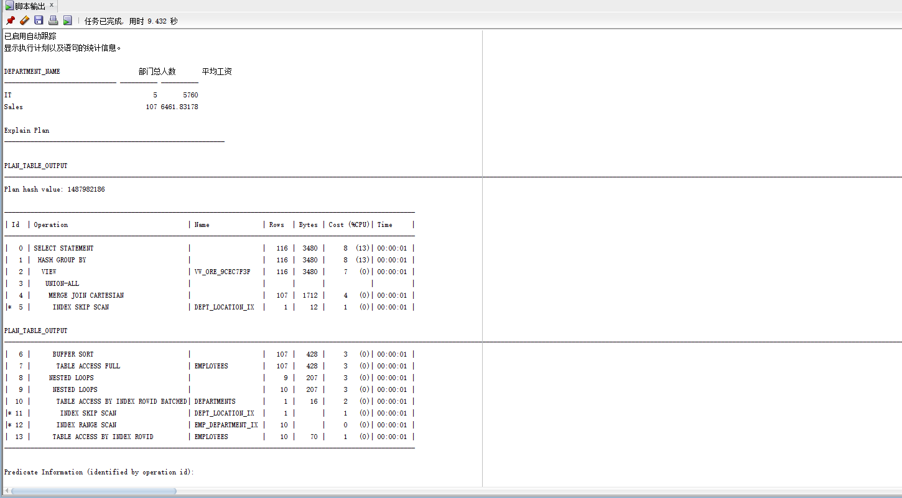
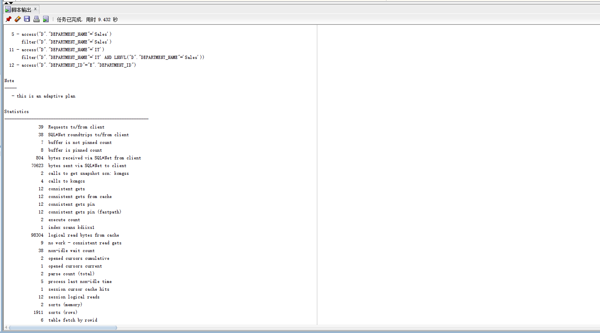
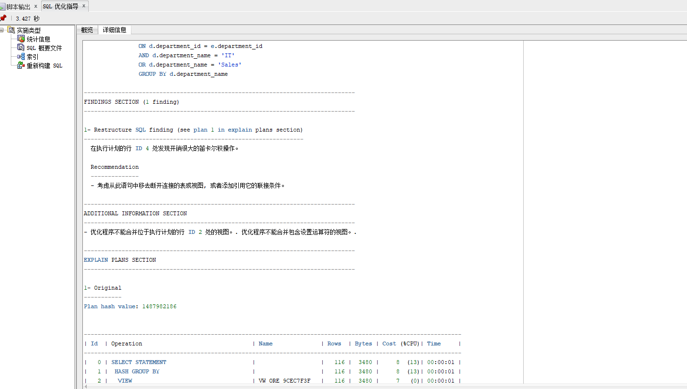

## 实验一 SQL语句的执行计划分析与优化指导

#### 姓名：喻丹  学号：201810414203   班级：18级软工2班

### 实验目的

分析SQL执行计划，执行SQL语句的优化指导。理解分析SQL语句的执行计划的重要作用。

### 实验内容

·对Oracle12c中的HR人力资源管理系统中的表进行查询与分析。
·首先运行和分析教材中的样例:本训练任务目的是查询两个部门(IT和Sales)的部门总人数和平均工资，以下两个查询的结果是一样的。但效率不相同。
·设计自己的查询语句，并作相应的分析，查询语句不能太简单。

#### 语句一:

set autotrace on

SELECT d.department_name,count(e.job_id)as "部门总人数",
avg(e.salary)as "平均工资"
from hr.departments d,hr.employees e
where d.department_id = e.department_id
and d.department_name in ('IT','Sales')
GROUP BY d.department_name;

##### 查询结果：

##### 执行计划：

#### 语句二：

set autotrace on

SELECT d.department_name,count(e.job_id)as "部门总人数",
avg(e.salary)as "平均工资"
FROM hr.departments d,hr.employees e
WHERE d.department_id = e.department_id
GROUP BY d.department_name
HAVING d.department_name in ('IT','Sales');

##### 查询结果：

##### 执行计划：

##### 通过对两个SQL语句的执行计划分析，我们可以发现语句一的consistent gets 为 6，语句二的consistent gets 为 13，两相比较，我觉得语句一是两个SQL语句中最优的。

##### 优化指导详细信息：

###### 通过优化指导工具分析截图，我们可以看出该工具没有给出优化建议。

#### 自己设计的语句：

set autotrace on

SELECT d.department_name,count(e.job_id)as "部门总人数",
avg(e.salary)as "平均工资"
FROM hr.departments d
INNER JOIN
hr.employees e
ON d.department_id = e.department_id
AND d.department_name = 'IT'
OR d.department_name = 'Sales'
GROUP BY d.department_name

##### 执行计划：

##### 通过分析执行计划，我发现自己设计的语句的consistent gets 为 12 ，然后我使用优化指导工具进行优化指导，看该工具给出的优化建议。

##### 优化指导概览：

