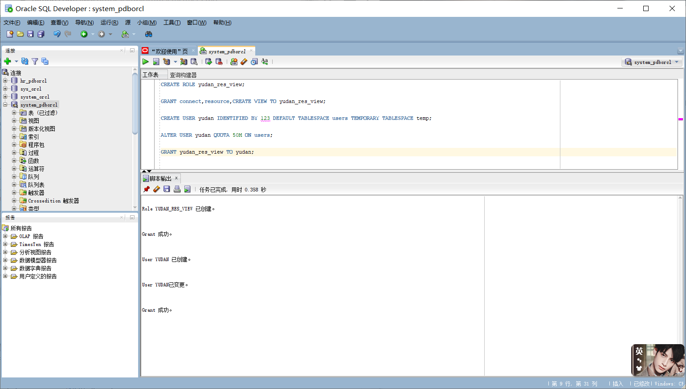
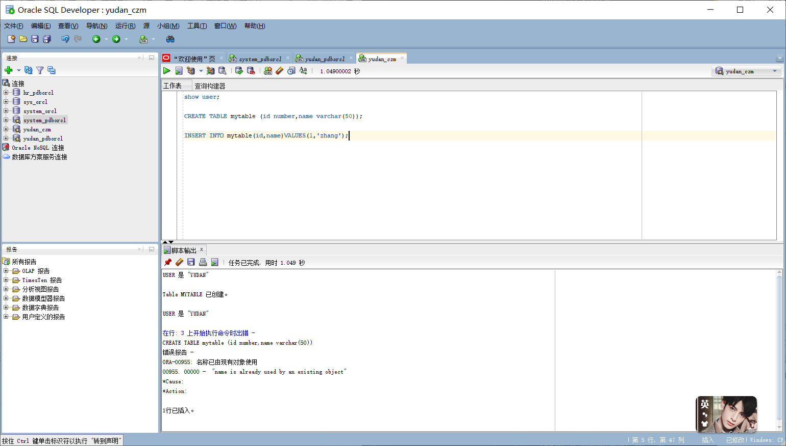
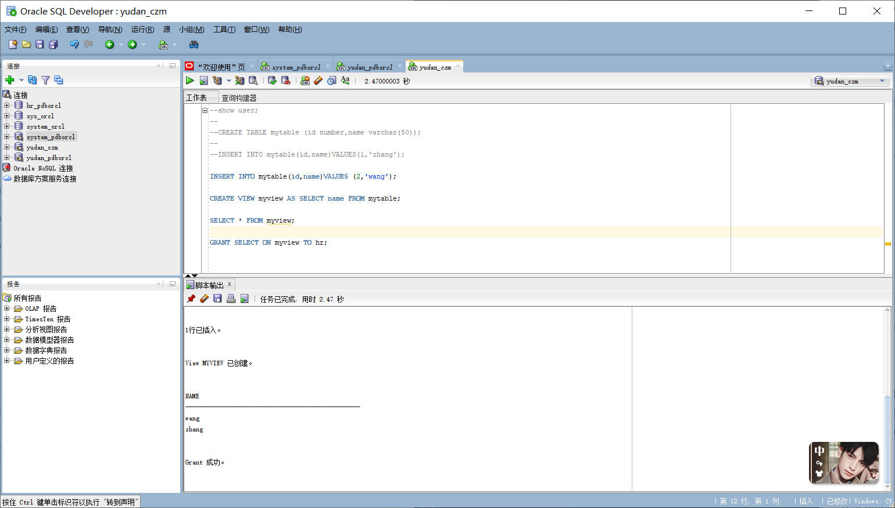
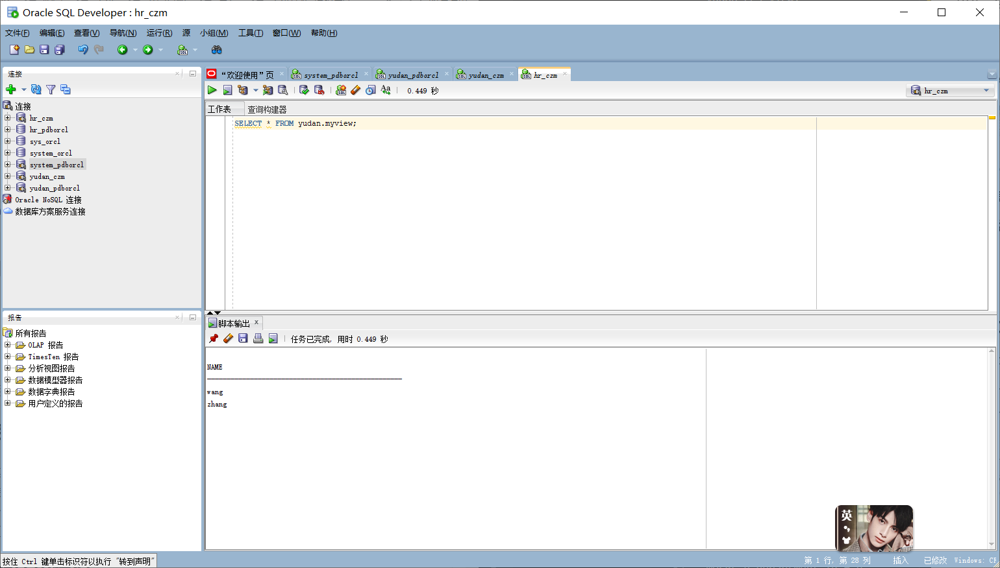
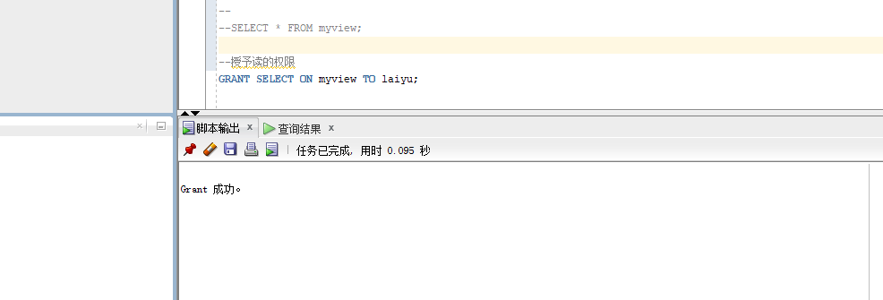
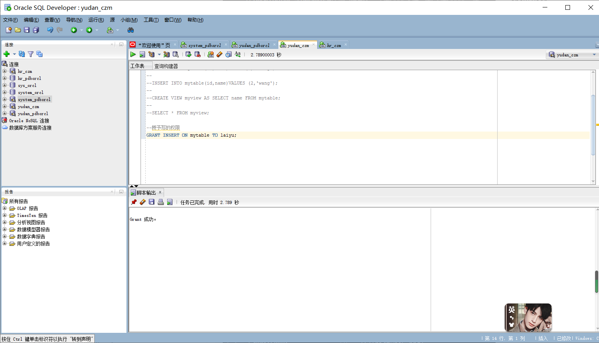
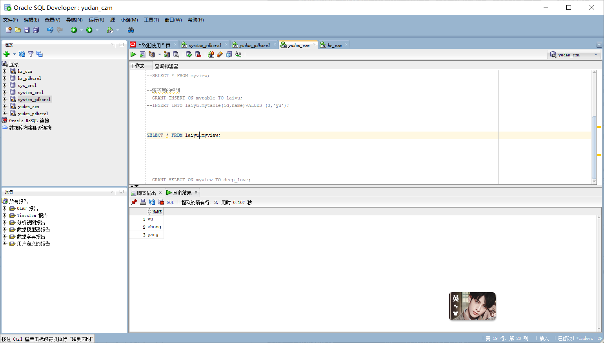
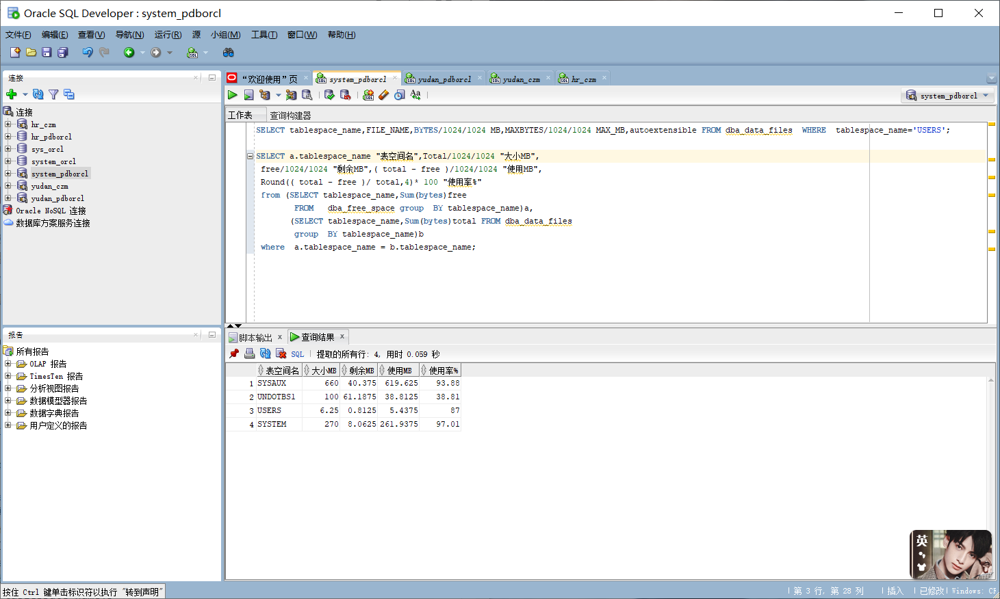

## 实验二 SQL语句的执行计划分析与优化指导

#### 姓名：喻丹  学号：201810414203   班级：18级软工2班

#### 用户名：yudan

### 实验目的

掌握用户管理、角色管理、权根维护与分配的能力，掌握用户之间共享对象的操作技能。

### 实验内容

Oracle有一个开发者角色resource，可以创建表、过程、触发器等对象，但是不能创建视图。本训练要求:
·在pdbord插接式数据中创建一个新的本地角色con_res_view，该角色包含connect和resource角色，同时也包含CREATEVIEW权限，这样任何拥有con_res_view的用户就同时拥有这三种权限。
·创建角色之后，再创建用户new_user，给用户分配表空间，设置限额为50M，授予con_res_view角色。
·最后测试:用新用户new_user连接数据库、创建表，插入数据，创建视图，查询表和视图的数据。

### 实验步骤:

#### 步骤一：

以system登录到pdborcl，创建角色yudan_res_view和用户yudan，并授权和分配空间，空间限额是50M：

SQL> CREATE ROLE yudan_res_view;

SQL> GRANT connect,resource,CREATE VIEW TO yudan_res_view;

SQL> CREATE USER yudan IDENTIFIED BY 123 DEFAULT TABLESPACE users TEMPORARY TABLESPACE temp;

SQL> ALTER USER yudan QUOTA 50M ON users;

SQL> GRANT yudan_res_view TO yudan;

SQL> exit

#### 步骤二：

新用户yudan连接到pdborcl，创建表mytable和视图myview，插入数据，最后将myview的SELECT对象权限授予hr用户。

SQL> show user;

SQL> CREATE TABLE mytable (id number,name varchar(50));

SQL> INSERT INTO mytable(id,name)VALUES(1,'zhang');

SQL> INSERT INTO mytable(id,name)VALUES (2,'wang');

SQL> CREATE VIEW myview AS SELECT name FROM mytable;

SQL> SELECT * FROM myview;

SQL> GRANT SELECT ON myview TO hr;

#### 步骤三：

用户hr连接到pdborcl，查询yudan授予它的视图myview

SQL> SELECT * FROM yudan.myview;

#### 步骤四：

测试一下同学用户之间的表的共享，只读共享和读写共享都测试一下

先给同学进行授权：

给用户laiyu读myview的权限
SQL> GRANT SELECT ON myview TO laiyu;

给用户laiyu写mytable的权限
SQL> GRANT INSERT ON mytable TO laiyu;

测试与用户laiyu的表的只读和读写共享
SQL> INSERT INTO laiyu.mytable(id,name)VALUES (3,'yu');

SQL> SELECT * FROM laiyu.myview;

#### 步骤五：

查看数据库的使用情况，查看表空间的数据库文件，以及每个文件的磁盘占用情况。

SQL>SELECT tablespace_name,FILE_NAME,BYTES/1024/1024 MB,MAXBYTES/1024/1024 MAX_MB,autoextensible FROM dba_data_files  WHERE  tablespace_name='USERS';

SQL>SELECT a.tablespace_name "表空间名",Total/1024/1024 "大小MB",
 free/1024/1024 "剩余MB",( total - free )/1024/1024 "使用MB",
 Round(( total - free )/ total,4)* 100 "使用率%"
 from (SELECT tablespace_name,Sum(bytes)free
        FROM   dba_free_space group  BY tablespace_name)a,
       (SELECT tablespace_name,Sum(bytes)total FROM dba_data_files
        group  BY tablespace_name)b
 where  a.tablespace_name = b.tablespace_name;

#### 实验总结

通过一系列操作掌握了角色管理、用户管理、权根维护与分配的能力，还掌握用户之间共享对象的操作技能。