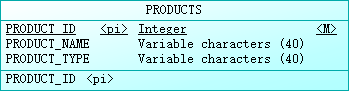
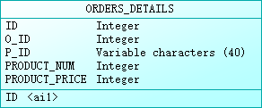

# 实验6：基于Oracle的农产品销售数据库设计

#### 姓名：喻丹  学号：201810414203   班级：18级软工2班

## 实验要求

- 自行设计一个信息系统的数据库项目，自拟`某项目`名称。
- 设计项目涉及的表及表空间使用方案。至少5张表和5万条数据，两个表空间。
- 设计权限及用户分配方案。至少两类角色，两个用户。
- 在数据库中建立一个程序包，在包中用PL/SQL语言设计一些存储过程和函数，实现比较复杂的业务逻辑，用模拟数据进行执行计划分析。
- 设计自动备份方案或则手工备份方案。
- 设计容灾方案。使用两台主机，通过DataGuard实现数据库整体的异地备份(可选)。

## 实验内容

### 目的

当今信息技术的全面发展和网络大环境的完善,以网上买卖为主的电子商务行业飞快发展。我国是闻名世界的农产品大国,而农业又是国家经济的支柱,网购的迅速发展极大地推动了农产品销售业的成长。线上农产品销售，利用网上购物商城，进行网上销售，与传统销售相比，有助于及时获取农产品供求信息，降低交易成本，提高效率。 这个农产品销售管理系统是将IT技术用于农产品销售信息的管理，它能收集和存储农产品销售的信息，提供更新与检索销售信息档案的接口;来提高农产品销售的工作效率。

## 实验步骤

### 1.农产品销售管理系统E-R设计

有3个实体：部门、员工、商品

部门

员工

商品

订单表

订单详表

E-R关系总设计

### 2 表结构设计

部门表DEPARTMENTS
|  字段名   | 数据类型   |  可以为NULL  |  注释                |
|  ----     |   ----    |     ----    | ----                |
| DEPARTMENT_ID  | NUMBER(6,0) | NO  | 部门ID,主键          |
| DEPARTMENT_NAME| VARCHAR2(40 BYTE) | NO  | 部门名称，非空 |

员工表EMPLOYEES
|  字段名   | 数据类型   |  可以为NULL  |  注释                |
|  ----     |   ----    |     ----    | ----                |
| EMPLOYEE_ID  | NUMBER(6,0) | NO  | 员工ID,主键          |
| NAME | VARCHAR2(40 BYTE) | NO  | 员工名字,不能为空，创建不唯一B树索引 |
| EMAIL | VARCHAR2(40 BYTE)  | YES  | 员工邮箱         |
| PHONE_NUMBER| VARCHAR2(40 BYTE) | YES  | 员工电话号码 |
| HIRE_DATE | DATE | NO  | 雇用日期     |
| SALARY| NUMBER(8,2) | YES  | 工资,>0 |
| DEPARTMENT_ID  | NUMBER(6,0) | YES  | 员工的部门ID,是DEPARTMENTS的外键          |

产品表PRODUCTS
|  字段名   | 数据类型   |  可以为NULL  |  注释       |
|  ----     |   ----    |     ----    | ----       |
| PRODUCT_ID  | NUMBER(6,0) | NO  | 产品ID，产品表主键 |
| PRODUCT_NAME| VARCHAR2(40 BYTE) | NO  | 产品名称 |
| PRODUCT_TYPE| VARCHAR2(40 BYTE) | NO  | 产品类型，只能取值：'土鸡蛋', '有机蔬菜', '种子种苗' |

订单表ORDERS
|  字段名   | 数据类型   |  可以为NULL  |  注释       |
|  ----     |   ----    |     ----    | ----       |
| ORDER_ID | NUMBER(10,0) | NO  | 订单ID,主键,值来自于SEQ_ORDER_ID|
| CUSTOMER_NAME| VARCHAR2(40 BYTE) | NO  | 客户名称，B数索引 |
| CUSTOMER_TEL| VARCHAR2(40 BYTE) | NO  | 客户电话 |
| ORDER_DATE  | DATE | NO  | 订单日期，应该采用分区储存方式 |
| EMPLOYEE_ID| NUMBER(6,0 | NO  | 订单经手人，员工表EMPLOYEES的外键|
| DISCOUNT| Number(8,2) | YES  | 订单整体优惠金额，默认为0 |
| TRADE_RECEIVABLE  | Number(8,2)  | YES  | 订单应收货款，默认为0    |

订单详单表ORDERS_DETAILS
|  字段名   | 数据类型   |  可以为NULL  |  注释       |
|  ----     |   ----    |     ----    | ----       |
| ID  | NUMBER(10,0) | NO  | 订单详单ID,主键,值来自于SEQ_ORDER_ID|
| ORDER_ID| NUMBER(10,0) | NO  | 订单号，订单表ORDERS的外键 |
| PRODUCT_ID| VARCHAR2(40 BYTE) | NO  | 产品ID,产品表PRODUCTS的外键 |
| PRODUCT_NUM  | NUMBER(8,2) | NO  | 产品销售数量，>0|
| PRODUCT_PRICE| NUMBER(8,2) | NO  | 产品销售价格|

### 3.用户权限设计

首先要创建新用户,然后创建表空间，再给其分配表空间，以及其他的权限。

    Create Tablespace Users02
    datafile
    '/home/oracle/app/oracle/oradata/orcl/pdborcl/pdbtest_users02_1.dbf'
    SIZE 100M AUTOEXTEND ON NEXT 256M MAXSIZE UNLIMITED,
    '/home/oracle/app/oracle/oradata/orcl/pdborcl/pdbtest_users02_2.dbf'
    SIZE 100M AUTOEXTEND ON NEXT 256M MAXSIZE UNLIMITED
    EXTENT MANAGEMENT LOCAL SEGMENT SPACE MANAGEMENT AUTO;
    
    --创建用户YUDAN
    CREATE USER YUDAN IDENTIFIED BY 123
    DEFAULT TABLESPACE "USERS"
    TEMPORARY TABLESPACE "TEMP";
    
    -- QUOTAS
    ALTER USER YUDAN QUOTA UNLIMITED ON USERS;
    ALTER USER YUDAN QUOTA UNLIMITED ON USERS02;
    
    -- ROLES
    GRANT "CONNECT" TO YUDAN WITH ADMIN OPTION;
    GRANT "RESOURCE" TO YUDAN WITH ADMIN OPTION;
    ALTER USER YUDAN DEFAULT ROLE "CONNECT","RESOURCE";
    
    -- SYSTEM PRIVILEGES
    GRANT CREATE VIEW TO YUDAN WITH ADMIN OPTION;
    
    --创建用户DP
    CREATE USER DP IDENTIFIED BY 123
    DEFAULT TABLESPACE "USERS"
    TEMPORARY TABLESPACE "TEMP";
    
    -- QUOTAS
    ALTER USER DP QUOTA UNLIMITED ON USERS;
    ALTER USER DP QUOTA UNLIMITED ON USERS02;
    
    -- ROLES
    GRANT "CONNECT" TO DP WITH ADMIN OPTION;
    GRANT "RESOURCE" TO DP WITH ADMIN OPTION;
    ALTER USER DP DEFAULT ROLE "CONNECT","RESOURCE";
    
    -- SYSTEM PRIVILEGES
    GRANT CREATE VIEW TO DP WITH ADMIN OPTION;

### 4.数据表设计和添加数据

删除数据表：
建立表之前要先对要建立确已有的表进行删除，先执行语句去匹配，如果匹配到就将那张表删除，如果不存在匹配的表之后就可以直接建立新的数据表。

    declare
      num   number;
    begin
        select count(1) into num from user_tables where TABLE_NAME = 'DEPARTMENTS';
        if   num=1   then
            execute immediate 'drop table DEPARTMENTS cascade constraints PURGE';
        end   if;
        select count(1) into num from user_tables where TABLE_NAME = 'EMPLOYEES';
        if   num=1   then
            execute immediate 'drop table EMPLOYEES cascade constraints PURGE';
        end   if;
        select count(1) into num from user_tables where TABLE_NAME = 'ORDER_ID_TEMP';
        if   num=1   then
            execute immediate 'drop table ORDER_ID_TEMP cascade constraints PURGE';
        end   if;
        select count(1) into num from user_tables where TABLE_NAME = 'ORDER_DETAILS';
        if   num=1   then
            execute immediate 'drop table ORDER_DETAILS cascade constraints PURGE';
        end   if;
        select count(1) into num from user_tables where TABLE_NAME = 'ORDERS';
        if   num=1   then
            execute immediate 'drop table ORDERS cascade constraints PURGE';
        end   if;
        select count(1) into num from user_tables where TABLE_NAME = 'PRODUCTS';
        if   num=1   then
            execute immediate 'drop table PRODUCTS cascade constraints PURGE';
        end   if;
        select count(1) into num from user_sequences where SEQUENCE_NAME = 'SEQ_ORDER_DETAILS_ID';
        if   num=1   then
            execute immediate 'drop  SEQUENCE SEQ_ORDER_DETAILS_ID';
        end   if;
        select count(1) into num from user_sequences where SEQUENCE_NAME = 'SEQ_ORDER_ID';
        if   num=1   then
            execute immediate 'drop  SEQUENCE SEQ_ORDER_ID';
        end   if;
        select count(1) into num from user_views where VIEW_NAME = 'VIEW_ORDER_DETAILS';
        if   num=1   then
            execute immediate 'drop VIEW VIEW_ORDER_DETAILS';
        end   if;
        SELECT count(object_name)  into num FROM user_objects_ae WHERE object_type = 'PACKAGE' and OBJECT_NAME='MYPACK';
        if   num=1   then
            execute immediate 'DROP PACKAGE MYPACK';
        end   if;
    end;
    /

创建DEPARTMENTS表

    CREATE TABLE DEPARTMENTS
    (
    DEPARTMENT_ID NUMBER(6, 0) NOT NULL
    , DEPARTMENT_NAME VARCHAR2(40 BYTE) NOT NULL
    , CONSTRAINT DEPARTMENTS_PK PRIMARY KEY
    (
        DEPARTMENT_ID
    )
    USING INDEX
    (
        CREATE UNIQUE INDEX DEPARTMENTS_PK ON DEPARTMENTS (DEPARTMENT_ID ASC)
        NOLOGGING
        TABLESPACE USERS
        PCTFREE 10
        INITRANS 2
        STORAGE
        (
            INITIAL 65536
            NEXT 1048576
            MINEXTENTS 1
            MAXEXTENTS UNLIMITED
            BUFFER_POOL DEFAULT
        )
        NOPARALLEL
    )
    ENABLE
    )
    NOLOGGING
    TABLESPACE USERS
    PCTFREE 10
    INITRANS 1
    STORAGE
    (
    INITIAL 65536
    NEXT 1048576
    MINEXTENTS 1
    MAXEXTENTS UNLIMITED
    BUFFER_POOL DEFAULT
    )
    NOCOMPRESS NO INMEMORY NOPARALLEL;

创建EMPLOYEES表

    CREATE TABLE EMPLOYEES
    (
    EMPLOYEE_ID NUMBER(6, 0) NOT NULL
    , NAME VARCHAR2(40 BYTE) NOT NULL
    , EMAIL VARCHAR2(40 BYTE)
    , PHONE_NUMBER VARCHAR2(40 BYTE)
    , HIRE_DATE DATE NOT NULL
    , SALARY NUMBER(8, 2)
    , MANAGER_ID NUMBER(6, 0)
    , DEPARTMENT_ID NUMBER(6, 0)
    , PHOTO BLOB
    , CONSTRAINT EMPLOYEES_PK PRIMARY KEY
    (
        EMPLOYEE_ID
    )
    USING INDEX
    (
        CREATE UNIQUE INDEX EMPLOYEES_PK ON EMPLOYEES (EMPLOYEE_ID ASC)
        NOLOGGING
        TABLESPACE USERS
        PCTFREE 10
        INITRANS 2
        STORAGE
        (
            INITIAL 65536
            NEXT 1048576
            MINEXTENTS 1
            MAXEXTENTS UNLIMITED
            BUFFER_POOL DEFAULT
        )
        NOPARALLEL
    )
    ENABLE
    )
    NOLOGGING
    TABLESPACE USERS
    PCTFREE 10
    INITRANS 1
    STORAGE
    (
    INITIAL 65536
    NEXT 1048576
    MINEXTENTS 1
    MAXEXTENTS UNLIMITED
    BUFFER_POOL DEFAULT
    )
    NOCOMPRESS
    NO INMEMORY
    NOPARALLEL
    LOB (PHOTO) STORE AS SYS_LOB0000092017C00009$$
    (
    ENABLE STORAGE IN ROW
    CHUNK 8192
    NOCACHE
    NOLOGGING
    TABLESPACE USERS
    STORAGE
    (
        INITIAL 106496
        NEXT 1048576
        MINEXTENTS 1
        MAXEXTENTS UNLIMITED
        BUFFER_POOL DEFAULT
    )
    );
    
    CREATE INDEX EMPLOYEES_INDEX1_NAME ON EMPLOYEES (NAME ASC)
    NOLOGGING
    TABLESPACE USERS
    PCTFREE 10
    INITRANS 2
    STORAGE
    (
    INITIAL 65536
    NEXT 1048576
    MINEXTENTS 1
    MAXEXTENTS UNLIMITED
    BUFFER_POOL DEFAULT
    )
    NOPARALLEL;
    
    ALTER TABLE EMPLOYEES
    ADD CONSTRAINT EMPLOYEES_FK1 FOREIGN KEY
    (
    DEPARTMENT_ID
    )
    REFERENCES DEPARTMENTS
    (
    DEPARTMENT_ID
    )
    ENABLE;
    
    ALTER TABLE EMPLOYEES
    ADD CONSTRAINT EMPLOYEES_FK2 FOREIGN KEY
    (
    MANAGER_ID
    )
    REFERENCES EMPLOYEES
    (
    EMPLOYEE_ID
    )
    ON DELETE SET NULL ENABLE;
    
    ALTER TABLE EMPLOYEES
    ADD CONSTRAINT EMPLOYEES_CHK1 CHECK
    (SALARY>0)
    ENABLE;
    
    ALTER TABLE EMPLOYEES
    ADD CONSTRAINT EMPLOYEES_CHK2 CHECK
    (EMPLOYEE_ID<>MANAGER_ID)
    ENABLE;
    
    ALTER TABLE EMPLOYEES
    ADD CONSTRAINT EMPLOYEES_EMPLOYEE_MANAGER_ID CHECK
    (MANAGER_ID<>EMPLOYEE_ID)
    ENABLE;
    
    ALTER TABLE EMPLOYEES
    ADD CONSTRAINT EMPLOYEES_SALARY CHECK
    (SALARY>0)
    ENABLE;

创建PRODUCTS表

    CREATE TABLE PRODUCTS
    (
    PRODUCT_NAME VARCHAR2(40 BYTE) NOT NULL
    , PRODUCT_TYPE VARCHAR2(40 BYTE) NOT NULL
    , CONSTRAINT PRODUCTS_PK PRIMARY KEY
    (
        PRODUCT_NAME
    )
    ENABLE
    )
    LOGGING
    TABLESPACE "USERS"
    PCTFREE 10
    INITRANS 1
    STORAGE
    (
    INITIAL 65536
    NEXT 1048576
    MINEXTENTS 1
    MAXEXTENTS 2147483645
    BUFFER_POOL DEFAULT
    );
    
    ALTER TABLE PRODUCTS
    ADD CONSTRAINT PRODUCTS_CHK1 CHECK
    (PRODUCT_TYPE IN ('食品', '饮料', '生活用品'))
    ENABLE;

创建ORDERS表及相关表, 表空间：分区表：USERS,USERS02

    CREATE GLOBAL TEMPORARY TABLE "ORDER_ID_TEMP"
    ("ORDER_ID" NUMBER(10,0) NOT NULL ENABLE,
        CONSTRAINT "ORDER_ID_TEMP_PK" PRIMARY KEY ("ORDER_ID") ENABLE
    ) ON COMMIT DELETE ROWS ;
    
    COMMENT ON TABLE "ORDER_ID_TEMP"  IS '用于触发器存储临时ORDER_ID';
    
    CREATE TABLE ORDERS
    (
    ORDER_ID NUMBER(10, 0) NOT NULL
    , CUSTOMER_NAME VARCHAR2(40 BYTE) NOT NULL
    , CUSTOMER_TEL VARCHAR2(40 BYTE) NOT NULL
    , ORDER_DATE DATE NOT NULL
    , EMPLOYEE_ID NUMBER(6, 0) NOT NULL
    , DISCOUNT NUMBER(8, 2) DEFAULT 0
    , TRADE_RECEIVABLE NUMBER(8, 2) DEFAULT 0
    )
    TABLESPACE USERS
    PCTFREE 10
    INITRANS 1
    STORAGE
    (
    BUFFER_POOL DEFAULT
    )
    NOCOMPRESS
    NOPARALLEL
    PARTITION BY RANGE (ORDER_DATE)
    (
    PARTITION PARTITION_BEFORE_2016 VALUES LESS THAN (TO_DATE(' 2016-01-01 00:00:00', 'SYYYY-MM-DD HH24:MI:SS', 'NLS_CALENDAR=GREGORIAN'))
    NOLOGGING
    TABLESPACE USERS
    PCTFREE 10
    INITRANS 1
    STORAGE
    (
        INITIAL 8388608
        NEXT 1048576
        MINEXTENTS 1
        MAXEXTENTS UNLIMITED
        BUFFER_POOL DEFAULT
    )
    NOCOMPRESS NO INMEMORY
    , PARTITION PARTITION_BEFORE_2017 VALUES LESS THAN (TO_DATE(' 2017-01-01 00:00:00', 'SYYYY-MM-DD HH24:MI:SS', 'NLS_CALENDAR=GREGORIAN'))
    NOLOGGING
    TABLESPACE USERS02
    PCTFREE 10
    INITRANS 1
    STORAGE
    (
        INITIAL 8388608
        NEXT 1048576
        MINEXTENTS 1
        MAXEXTENTS UNLIMITED
        BUFFER_POOL DEFAULT
    )
    NOCOMPRESS NO INMEMORY
    );

--创建本地分区索引ORDERS_INDEX_DATE：

    CREATE INDEX ORDERS_INDEX_DATE ON ORDERS (ORDER_DATE ASC)
    LOCAL
    (
    PARTITION PARTITION_BEFORE_2016
        TABLESPACE USERS
        PCTFREE 10
        INITRANS 2
        STORAGE
        (
        INITIAL 8388608
        NEXT 1048576
        MINEXTENTS 1
        MAXEXTENTS UNLIMITED
        BUFFER_POOL DEFAULT
        )
        NOCOMPRESS
    , PARTITION PARTITION_BEFORE_2017
        TABLESPACE USERS02
        PCTFREE 10
        INITRANS 2
        STORAGE
        (
        INITIAL 8388608
        NEXT 1048576
        MINEXTENTS 1
        MAXEXTENTS UNLIMITED
        BUFFER_POOL DEFAULT
        )
        NOCOMPRESS
    )
    STORAGE
    (
    BUFFER_POOL DEFAULT
    )
    NOPARALLEL;
    
    CREATE INDEX ORDERS_INDEX_CUSTOMER_NAME ON ORDERS (CUSTOMER_NAME ASC)
    NOLOGGING
    TABLESPACE USERS
    PCTFREE 10
    INITRANS 2
    STORAGE
    (
    INITIAL 65536
    NEXT 1048576
    MINEXTENTS 1
    MAXEXTENTS UNLIMITED
    BUFFER_POOL DEFAULT
    )
    NOPARALLEL;
    
    CREATE UNIQUE INDEX ORDERS_PK ON ORDERS (ORDER_ID ASC)
    GLOBAL PARTITION BY HASH (ORDER_ID)
    (
    PARTITION INDEX_PARTITION1 TABLESPACE USERS
        NOCOMPRESS
    , PARTITION INDEX_PARTITION2 TABLESPACE USERS02
        NOCOMPRESS
    )
    NOLOGGING
    TABLESPACE USERS
    PCTFREE 10
    INITRANS 2
    STORAGE
    (
    INITIAL 65536
    NEXT 1048576
    MINEXTENTS 1
    MAXEXTENTS UNLIMITED
    BUFFER_POOL DEFAULT
    )
    NOPARALLEL;
    
    ALTER TABLE ORDERS
    ADD CONSTRAINT ORDERS_PK PRIMARY KEY
    (
    ORDER_ID
    )
    USING INDEX ORDERS_PK
    ENABLE;
    
    ALTER TABLE ORDERS
    ADD CONSTRAINT ORDERS_FK1 FOREIGN KEY
    (
    EMPLOYEE_ID
    )
    REFERENCES EMPLOYEES
    (
    EMPLOYEE_ID
    )
    ENABLE;
    
    CREATE TABLE ORDER_DETAILS
    (
    ID NUMBER(10, 0) NOT NULL
    , ORDER_ID NUMBER(10, 0) NOT NULL
    , PRODUCT_NAME VARCHAR2(40 BYTE) NOT NULL
    , PRODUCT_NUM NUMBER(8, 2) NOT NULL
    , PRODUCT_PRICE NUMBER(8, 2) NOT NULL
    , CONSTRAINT ORDER_DETAILS_FK1 FOREIGN KEY
    (
    ORDER_ID
    )
    REFERENCES ORDERS
    (
    ORDER_ID
    )
    ENABLE
    )
    TABLESPACE USERS
    PCTFREE 10
    INITRANS 1
    STORAGE
    (
    BUFFER_POOL DEFAULT
    )
    NOCOMPRESS
    NOPARALLEL
    PARTITION BY REFERENCE (ORDER_DETAILS_FK1)
    (
    PARTITION PARTITION_BEFORE_2016
    NOLOGGING
    TABLESPACE USERS 
    --必须指定表空间，否则会将分区存储在用户的默认表空间中
    PCTFREE 10
    INITRANS 1
    STORAGE
    (
        INITIAL 8388608
        NEXT 1048576
        MINEXTENTS 1
        MAXEXTENTS UNLIMITED
        BUFFER_POOL DEFAULT
    )
    NOCOMPRESS NO INMEMORY,
    PARTITION PARTITION_BEFORE_2017
    NOLOGGING
    TABLESPACE USERS02
    PCTFREE 10
    INITRANS 1
    STORAGE
    (
        INITIAL 8388608
        NEXT 1048576
        MINEXTENTS 1
        MAXEXTENTS UNLIMITED
        BUFFER_POOL DEFAULT
    )
    NOCOMPRESS NO INMEMORY
    )
    ;
    
    CREATE UNIQUE INDEX ORDER_DETAILS_PK ON ORDER_DETAILS (ID ASC)
    NOLOGGING
    TABLESPACE USERS
    PCTFREE 10
    INITRANS 2
    STORAGE
    (
    INITIAL 65536
    NEXT 1048576
    MINEXTENTS 1
    MAXEXTENTS UNLIMITED
    BUFFER_POOL DEFAULT
    )
    NOPARALLEL;
    
    ALTER TABLE ORDER_DETAILS
    ADD CONSTRAINT ORDER_DETAILS_PK PRIMARY KEY
    (
    ID
    )
    USING INDEX ORDER_DETAILS_PK
    ENABLE;

--这个索引可以使整个订单的详单存放在一起

    CREATE INDEX ORDER_DETAILS_ORDER_ID ON ORDER_DETAILS (ORDER_ID)
    GLOBAL PARTITION BY HASH (ORDER_ID)
    (
    PARTITION INDEX_PARTITION1 TABLESPACE USERS
        NOCOMPRESS
    , PARTITION INDEX_PARTITION2 TABLESPACE USERS02
        NOCOMPRESS
    );
    
    ALTER TABLE ORDER_DETAILS
    ADD CONSTRAINT ORDER_DETAILS_PRODUCT_NUM CHECK
    (Product_Num>0)
    ENABLE;

创建3个触发器

    CREATE OR REPLACE EDITIONABLE TRIGGER "ORDERS_TRIG_ROW_LEVEL"
    BEFORE INSERT OR UPDATE OF DISCOUNT ON "ORDERS"
    FOR EACH ROW --行级触发器
    declare
    m number(8,2);
    BEGIN
    if inserting then
        :new.TRADE_RECEIVABLE := - :new.discount;
    else
        select sum(PRODUCT_NUM*PRODUCT_PRICE) into m from ORDER_DETAILS where ORDER_ID=:old.ORDER_ID;
        if m is null then
            m:=0;
        end if;
        :new.TRADE_RECEIVABLE := m - :new.discount;
    end if;
    END;
    /
--批量插入订单数据之前，禁用触发器

    ALTER TRIGGER "ORDERS_TRIG_ROW_LEVEL" DISABLE;
    
    CREATE OR REPLACE EDITIONABLE TRIGGER "ORDER_DETAILS_ROW_TRIG"
    AFTER DELETE OR INSERT OR UPDATE  ON ORDER_DETAILS
    FOR EACH ROW
    BEGIN
    --DBMS_OUTPUT.PUT_LINE(:NEW.ORDER_ID);
    IF :NEW.ORDER_ID IS NOT NULL THEN
        MERGE INTO ORDER_ID_TEMP A
        USING (SELECT 1 FROM DUAL) B
        ON (A.ORDER_ID=:NEW.ORDER_ID)
        WHEN NOT MATCHED THEN
        INSERT (ORDER_ID) VALUES(:NEW.ORDER_ID);
    END IF;
    IF :OLD.ORDER_ID IS NOT NULL THEN
        MERGE INTO ORDER_ID_TEMP A
        USING (SELECT 1 FROM DUAL) B
        ON (A.ORDER_ID=:OLD.ORDER_ID)
        WHEN NOT MATCHED THEN
        INSERT (ORDER_ID) VALUES(:OLD.ORDER_ID);
    END IF;
    END;
    /
    ALTER TRIGGER "ORDER_DETAILS_ROW_TRIG" DISABLE;
    
    CREATE OR REPLACE EDITIONABLE TRIGGER "ORDER_DETAILS_SNTNS_TRIG"
    AFTER DELETE OR INSERT OR UPDATE ON ORDER_DETAILS
    declare
    m number(8,2);
    BEGIN
    FOR R IN (SELECT ORDER_ID FROM ORDER_ID_TEMP)
    LOOP
        --DBMS_OUTPUT.PUT_LINE(R.ORDER_ID);
        select sum(PRODUCT_NUM*PRODUCT_PRICE) into m from ORDER_DETAILS
        where ORDER_ID=R.ORDER_ID;
        if m is null then
        m:=0;
        end if;
        UPDATE ORDERS SET TRADE_RECEIVABLE = m - discount
        WHERE ORDER_ID=R.ORDER_ID;
    END LOOP;
    --delete from ORDER_ID_TEMP;
    END;
    /
    ALTER TRIGGER "ORDER_DETAILS_SNTNS_TRIG" DISABLE;
    
    CREATE SEQUENCE  "SEQ_ORDER_ID"  MINVALUE 1 MAXVALUE 9999999999 INCREMENT BY 1 START WITH 1 CACHE 2000 ORDER  NOCYCLE  NOPARTITION ;
    
    CREATE SEQUENCE  "SEQ_ORDER_DETAILS_ID"  MINVALUE 1 MAXVALUE 9999999999 INCREMENT BY 1 START WITH 1 CACHE 2000 ORDER  NOCYCLE  NOPARTITION ;
    
    CREATE OR REPLACE FORCE EDITIONABLE VIEW "VIEW_ORDER_DETAILS" ("ID", "ORDER_ID", "CUSTOMER_NAME", "CUSTOMER_TEL", "ORDER_DATE", "PRODUCT_TYPE", "PRODUCT_NAME", "PRODUCT_NUM", "PRODUCT_PRICE") AS
    SELECT
    d.ID,
    o.ORDER_ID,
    o.CUSTOMER_NAME,o.CUSTOMER_TEL,o.ORDER_DATE,
    p.PRODUCT_TYPE,
    d.PRODUCT_NAME,
    d.PRODUCT_NUM,
    d.PRODUCT_PRICE
    FROM ORDERS o,ORDER_DETAILS d,PRODUCTS p where d.ORDER_ID=o.ORDER_ID and d.PRODUCT_NAME=p.PRODUCT_NAME;
    /

插入DEPARTMENTS，EMPLOYEES数据

    INSERT INTO DEPARTMENTS(DEPARTMENT_ID,DEPARTMENT_NAME) values (1,'总经办');
    INSERT INTO EMPLOYEES(EMPLOYEE_ID,NAME,EMAIL,PHONE_NUMBER,HIRE_DATE,SALARY,MANAGER_ID,DEPARTMENT_ID)
    VALUES (1,'赵董事长',NULL,NULL,to_date('2010-1-1','yyyy-mm-dd'),50000,NULL,1);
    
    INSERT INTO DEPARTMENTS(DEPARTMENT_ID,DEPARTMENT_NAME) values (11,'市场部');
    INSERT INTO EMPLOYEES(EMPLOYEE_ID,NAME,EMAIL,PHONE_NUMBER,HIRE_DATE,SALARY,MANAGER_ID,DEPARTMENT_ID)
    VALUES (11,'钱总',NULL,NULL,to_date('2010-1-1','yyyy-mm-dd'),50000,1,1);
    INSERT INTO EMPLOYEES(EMPLOYEE_ID,NAME,EMAIL,PHONE_NUMBER,HIRE_DATE,SALARY,MANAGER_ID,DEPARTMENT_ID)
    VALUES (111,'孙经理',NULL,NULL,to_date('2010-1-1','yyyy-mm-dd'),50000,11,11);
    INSERT INTO EMPLOYEES(EMPLOYEE_ID,NAME,EMAIL,PHONE_NUMBER,HIRE_DATE,SALARY,MANAGER_ID,DEPARTMENT_ID)
    VALUES (112,'李经理',NULL,NULL,to_date('2010-1-1','yyyy-mm-dd'),50000,11,11);
    
    INSERT INTO DEPARTMENTS(DEPARTMENT_ID,DEPARTMENT_NAME) values (12,'后勤部');
    INSERT INTO EMPLOYEES(EMPLOYEE_ID,NAME,EMAIL,PHONE_NUMBER,HIRE_DATE,SALARY,MANAGER_ID,DEPARTMENT_ID)
    VALUES (12,'周总',NULL,NULL,to_date('2010-1-1','yyyy-mm-dd'),50000,1,1);
    INSERT INTO EMPLOYEES(EMPLOYEE_ID,NAME,EMAIL,PHONE_NUMBER,HIRE_DATE,SALARY,MANAGER_ID,DEPARTMENT_ID)
    VALUES (121,'吴经理',NULL,NULL,to_date('2010-1-1','yyyy-mm-dd'),50000,12,12);
    INSERT INTO EMPLOYEES(EMPLOYEE_ID,NAME,EMAIL,PHONE_NUMBER,HIRE_DATE,SALARY,MANAGER_ID,DEPARTMENT_ID)
    VALUES (122,'郑经理',NULL,NULL,to_date('2010-1-1','yyyy-mm-dd'),50000,12,12);
    
    --插入products数据
    insert into products (product_name,product_type) values ('eggs1','土鸡蛋');
    insert into products (product_name,product_type) values ('eggs2','土鸡蛋');
    insert into products (product_name,product_type) values ('eggs3','土鸡蛋');
    
    insert into products (product_name,product_type) values ('vegetables1','有机蔬菜');
    insert into products (product_name,product_type) values (' vegetables2','有机蔬菜');
    insert into products (product_name,product_type) values (' vegetables3','有机蔬菜');
    
    insert into products (product_name,product_type) values ('seeds1','种子种苗');
    insert into products (product_name,product_type) values ('seeds2','种子种苗');
    insert into products (product_name,product_type) values ('seeds3','种子种苗');

批量插入订单数据，注意ORDERS.TRADE_RECEIVABLE（订单应收款）的自动计算

    declare
    dt date;
    m number(8,2);
    V_EMPLOYEE_ID NUMBER(6);
    v_order_id number(10);
    v_name varchar2(100);
    v_tel varchar2(100);
    v number(10,2);
    
    begin
    for i in 1..50000
    loop
        if i mod 2 =0 then
        dt:=to_date('2015-3-2','yyyy-mm-dd')+(i mod 60);
        else
        dt:=to_date('2016-3-2','yyyy-mm-dd')+(i mod 60);
        end if;
        V_EMPLOYEE_ID:=CASE I MOD 6 WHEN 0 THEN 11 WHEN 1 THEN 111 WHEN 2 THEN 112
                                    WHEN 3 THEN 12 WHEN 4 THEN 121 ELSE 122 END;
        --插入订单
        v_order_id:=SEQ_ORDER_ID.nextval; 
        v_name := 'aa'|| 'aa';
        v_name := 'Miku' || i;
        v_tel := '138923483' || i;
        insert /*+append*/ into ORDERS (ORDER_ID,CUSTOMER_NAME,CUSTOMER_TEL,ORDER_DATE,EMPLOYEE_ID,DISCOUNT)
        values (v_order_id,v_name,v_tel,dt,V_EMPLOYEE_ID,dbms_random.value(100,0));
        --插入订单y一个订单包括3个商品
        v:=dbms_random.value(10000,4000);
        v_name:='food'|| (i mod 3 + 1);
        insert /*+append*/ into ORDER_DETAILS(ID,ORDER_ID,PRODUCT_NAME,PRODUCT_NUM,PRODUCT_PRICE)
        values (SEQ_ORDER_DETAILS_ID.NEXTVAL,v_order_id,v_name,2,v);
        v:=dbms_random.value(1000,50);
        v_name:='drinks'|| (i mod 3 + 1);
        insert /*+append*/ into ORDER_DETAILS(ID,ORDER_ID,PRODUCT_NAME,PRODUCT_NUM,PRODUCT_PRICE)
        values (SEQ_ORDER_DETAILS_ID.NEXTVAL,v_order_id,v_name,3,v);
        v:=dbms_random.value(9000,2000);
        v_name:='articles of daily use'|| (i mod 3 + 1);
        insert /*+append*/ into ORDER_DETAILS(ID,ORDER_ID,PRODUCT_NAME,PRODUCT_NUM,PRODUCT_PRICE)
        values (SEQ_ORDER_DETAILS_ID.NEXTVAL,v_order_id,v_name,1,v);
        select sum(PRODUCT_NUM*PRODUCT_PRICE) into m from ORDER_DETAILS where ORDER_ID=v_order_id;
        if m is null then
        m:=0;
        end if;
        UPDATE ORDERS SET TRADE_RECEIVABLE = m - discount WHERE ORDER_ID=v_order_id;
        IF I MOD 1000 =0 THEN
        commit; 
        END IF;
    end loop;
    end;
    /
    
    ALTER TRIGGER "ORDERS_TRIG_ROW_LEVEL" ENABLE;
    ALTER TRIGGER "ORDER_DETAILS_SNTNS_TRIG" ENABLE;
    ALTER TRIGGER "ORDER_DETAILS_ROW_TRIG" ENABLE;

最后动态增加一个PARTITION_BEFORE_2021分区：

    ALTER TABLE ORDERS
    ADD PARTITION PARTITION_BEFORE_2018 VALUES LESS THAN (TO_DATE(' 2021-01-01 00:00:00', 'SYYYY-MM-DD HH24:MI:SS', 'NLS_CALENDAR=GREGORIAN'));
    
    ALTER INDEX ORDERS_INDEX_DATE
    MODIFY PARTITION PARTITION_BEFORE_2018
    NOCOMPRESS;

### 5.存储过程和函数设计

在包中用PL/SQL语言设计一些存储过程和函数，实现比较复杂的业务逻辑，用模拟数据进行执行计划分析。

    create or replace PACKAGE SPM_Pack IS
    /*
    包SPM_Pack中有：
    一个函数:Get_SaleAmount(V_DEPARTMENT_ID NUMBER)，
    一个过程:Get_Employees(V_EMPLOYEE_ID NUMBER)
    */
    FUNCTION Get_SaleAmount(V_DEPARTMENT_ID NUMBER) RETURN NUMBER;
    PROCEDURE Get_Employees(V_EMPLOYEE_ID NUMBER);
    END SPM_Pack;
    /
    create or replace PACKAGE BODY SPM_Pack IS
    FUNCTION Get_SaleAmount(V_DEPARTMENT_ID NUMBER) RETURN NUMBER
    AS
        N NUMBER(20,2);
        BEGIN
        SELECT SUM(O.TRADE_RECEIVABLE) into N  FROM ORDERS O,EMPLOYEES E
        WHERE O.EMPLOYEE_ID=E.EMPLOYEE_ID AND E.DEPARTMENT_ID =V_DEPARTMENT_ID;
        RETURN N;
        END;
    
    PROCEDURE GET_EMPLOYEES(V_EMPLOYEE_ID NUMBER)
    AS
        LEFTSPACE VARCHAR(2000);
        begin
        LEFTSPACE:=' ';
        for v in
        (SELECT LEVEL,EMPLOYEE_ID,NAME,MANAGER_ID FROM employees
        START WITH EMPLOYEE_ID = V_EMPLOYEE_ID
        CONNECT BY PRIOR EMPLOYEE_ID = MANAGER_ID)
        LOOP
            DBMS_OUTPUT.PUT_LINE(LPAD(LEFTSPACE,(V.LEVEL-1)*4,' ')||
                                V.EMPLOYEE_ID||' '||v.NAME);
        END LOOP;
        END;
    END SPM_Pack;
    /

### 6.备份方案设计

利用Export可将数据从数据库中提取出来，利用Import则可将提取出来的数据送回到Oracle数据库中去。

１、 简单导出数据（Export）和导入数据（Import）
Oracle支持三种方式类型的输出：
（１）表方式（T方式），将指定表的数据导出。
（２）用户方式（U方式），将指定用户的所有对象及数据导出。
（３）全库方式（Full方式），瘵数据库中的所有对象导出。
数据导入（Import）的过程是数据导出（Export）的逆过程，分别将数据文件导入数据库和将数据库数据导出到数据文件。

２、 增量导出／导入
增量导出是一种常用的数据备份方法，它只能对整个数据库来实施，并且必须作为SYSTEM来导出。在进行此种导出时，系统不要求回答任何问题。导出文件名缺省为export.dmp，如果不希望自己的输出文件定名为export.dmp，必须在命令行中指出要用的文件名。
增量导出包括三种类型：
（１）、“完全”增量导出（Complete）
即备份三个数据库，比如：
exp system/manager inctype=complete file=040731.dmp
（２）、“增量型”增量导出
备份上一次备份后改变的数据，比如：
exp system/manager inctype=incremental file=040731.dmp

（３）、“累积型”增量导出
累计型导出方式是导出自上次“完全”导出之后数据库中变化了的信息。比如：
exp system/manager inctype=cumulative file=040731.dmp
如果数据库遭到意外破坏，数据库管理员可按一下步骤来回复数据库：
第一步：用命令CREATE DATABASE重新生成数据库结构；
第二步：创建一个足够大的附加回滚。
第三步：完全增量导入A：
imp system/manager inctype=RESTORE FULL=y FILE=A
第四步：累计增量导入E：
imp system/manager inctype=RESTORE FULL=Y FILE=E
第五步：最近增量导入F：
imp system/manager inctype=RESTORE FULL=Y FILE=F

支持类型： table, user， tablespace， full database

数据库导出expdp
step1: system登录，创建目录，授权给自己用户
[student@deep02 ~]$ sqlplus system/123@202.115.82.8/pdborcl
SQL>create or replace directory expdir as '/home/student/pdborcl_expdir';

SQL> grant read,write on directory expdir to yudan;
授权成功。
SQL>exit

step2: 自己用户备份
[student@deep02 pdborcl_expdir]$ expdp yudan/123@202.115.82.8/pdborcl directory=expdir dumpfile=yudan.dmp

数据库导入impdp
step1: 删除表

[student@deep02 ~]$ sqlplus yudan/123@pdborcl

SQL> drop table order_details;
表已删除。
SQL> drop table orders;
表已删除。
SQL> exit

step2: 恢复数据
[student@deep02 ~]$ impdp yudan/123@202.115.82.8/pdborcl directory=expdir dumpfile=yudan.dmp

### 7.总结

这个实验是一个综合性的实验，让我能对一个管理系统的数据库进行从头到尾的设计，其中运用到了各种在课上和平时实验所学所做，让我对平时所学习到的知识有了很好的巩固作用，理解的也更清晰、透彻、扎实，让我能运用自如。我还对数据库备份进行了深入的学习，虽然备份方式有很多种，但是我觉得最稳妥的还是导出数据，将数据存储在外部，这种物理备份虽然有点麻烦，但是所面临的失去数据的风险更小。数据库的知识还有很多需要去学习，更多地还需要自己去实际的动手练习才能理解的更清楚。